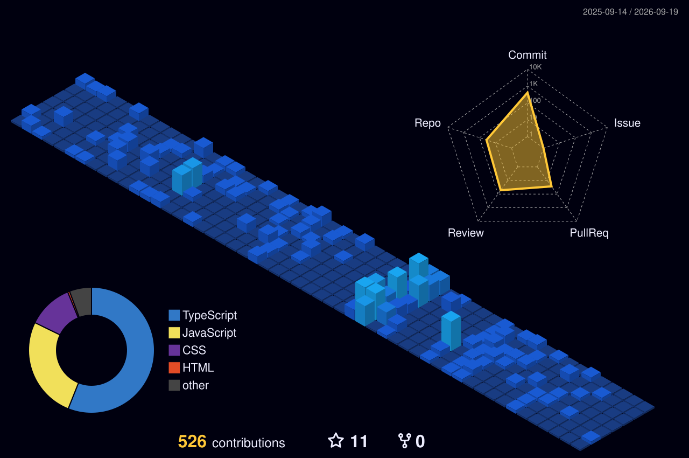

<h1 align="center">Hi, I’m Valerii Brykalov 👋</h1>

  

  <strong>Junior Fullstack Developer</strong> focused on clean UX, real product features, authentication flows, APIs, and maintainable web applications.

  
  
  

 

<h2 align="center">👨‍💻 About Me</h2>

I’m a Ukrainian **Junior Fullstack Developer** based in Norway.

I enjoy turning complex user flows into clean, responsive, and maintainable web experiences.

My strongest focus is building product-like applications with authentication, protected routes, dashboards, CRUD flows, API integration, state management, responsive layouts, and deployment-ready architecture.

I’ve already worked as a **Team Lead** and **Code Reviewer** in team projects, coordinating frontend/backend integration, reviewing pull requests, and helping keep architecture consistent.

Currently, my main goal is to grow from **Junior to Middle Developer** by building real-world features, improving system thinking, and becoming the kind of developer who can own a feature from idea to production.

 

<h2 align="center">🧰 Tech Stack</h2>

  <strong>Frontend</strong>

  

  <strong>Backend & Database</strong>

  

  <strong>Tools & Workflow</strong>

  

  
  
  
  
  

 

<h2 align="center">🚀 Featured Projects</h2>

### 🍼 Leleka | Pregnancy Tracker

  
  
  

A modern pregnancy tracking web application for expecting parents, focused on weekly pregnancy progress, personalized dashboard data, diary entries, task management, and user profile customization.

  <strong>Role:</strong> Team Lead / Fullstack Developer

**Key contributions:**

- Led the team and coordinated frontend/backend integration.
- Implemented cookie-based authentication with session refresh and protected user flows.
- Integrated Google authentication and handled user session state with Zustand.
- Built private and public dashboard data fetching with REST API integration.
- Implemented diary CRUD functionality with emotion categories, edit/delete modals, and TanStack Query cache invalidation.
- Built task management with creation, checkbox status updates, and optimistic UI updates.
- Created profile and onboarding forms with validation, avatar upload, due date picker, and dynamic theme switching.
- Implemented weekly journey pages with dynamic routing, week selection, protected future weeks, and separate baby/mother content tabs.
- Built responsive layouts with desktop sidebar, mobile header, burger menu, modals, and adaptive page views.
- Added SEO metadata, Open Graph image setup, custom domain support, and production deployment adjustments.
- Reviewed teammates’ code, managed pull requests, and helped maintain consistent architecture across the project.

**Tech Stack:**

`Next.js` `React` `TypeScript` `Node.js` `Express` `REST API` `Axios` `TanStack Query` `Zustand` `Formik` `Yup` `CSS Modules` `Google OAuth` `Git` `Vercel`

 

### 📝 NoteHub

  
  

A modern application for creating, managing, and organizing personal notes with authentication, optimized data handling, and advanced routing features.

  <strong>Role:</strong> Fullstack Developer

**Key contributions:**

- Implemented CRUD functionality for notes.
- Added search, filtering, and sorting for efficient note management.
- Integrated REST APIs and implemented data caching using TanStack Query.
- Built form validation with Formik and Yup.
- Implemented authentication with login/logout and protected routes.
- Used advanced Next.js routing: dynamic, parallel, and catch-all routes.
- Applied performance optimizations using debounced search.

**Tech Stack:**

`Next.js` `React` `TypeScript` `REST API` `TanStack Query` `Axios` `Zustand` `Formik` `Yup` `use-debounce` `Git`

 

### 🐾 Lapolis

  
  

A web application for a pet shelter that helps users find animals for adoption by browsing, filtering, and submitting adoption requests.

  <strong>Role:</strong> Frontend Developer / Code Reviewer

**Key contributions:**

- Developed the pets list section with animal data fetched via GET requests.
- Implemented filtering by animal type and custom pagination logic.
- Optimized data rendering and user interaction.
- Acted as the main code reviewer.
- Reviewed teammates’ sections, suggested improvements, managed pull requests, and handled merges into the main branch.

**Tech Stack:**

`HTML` `CSS` `JavaScript` `REST API` `Git` `Axios` `Swiper.js` `accordion-js` `SimpleLightbox` `iziToast`

 

### ☕ CoffeeJoy

  
  

A team-based website for a coffee shop, designed as a business card website to present the brand, atmosphere, and services.

  <strong>Role:</strong> Frontend Developer / Code Reviewer

**Key contributions:**

- Implemented the Experience section with responsive layout across different screen sizes.
- Acted as the main code reviewer and reviewed all project sections.
- Collaborated closely with the team lead to resolve issues.
- Tracked tasks and progress using Trello to support timely delivery under deadline.

**Tech Stack:**

`HTML` `CSS` `JavaScript` `Git` `Trello`

 

<h2 align="center">📊 GitHub Activity</h2>

  
  

  

  

  I usually build in focused sprints, then step back to study theory and upgrade my engineering brain.
   
  Basically: <strong>code sprint → brain upgrade → repeat</strong>.

 

<h2 align="center">🎯 Current Focus</h2>

- Growing from **Junior** to **Middle Fullstack Developer**.
- Improving architecture and system thinking.
- Building stronger production-ready applications.
- Practicing advanced Next.js, authentication, API design, and performance optimization.
- Looking for opportunities in **Trondheim, Norway**, hybrid roles, or remote positions.

 

<h2 align="center">🧠 Beyond Code</h2>

  
  
  
  
  

When I’m not coding, I’m probably planning a trip, cooking sushi, reading manga, exploring AI tools, or getting emotionally attached to a story-driven game character.

Completely normal developer behavior 😁

 

<h2 align="center">🌌 3D Contribution Graph</h2>

  

 

<h2 align="center">🐍 Contribution Snake</h2>

  <picture>
    <source
      media="(prefers-color-scheme: dark)"
      srcset="https://raw.githubusercontent.com/ValeriiBrykalov7/ValeriiBrykalov7/output/github-contribution-grid-snake-dark.svg"
    />
    <source
      media="(prefers-color-scheme: light)"
      srcset="https://raw.githubusercontent.com/ValeriiBrykalov7/ValeriiBrykalov7/output/github-contribution-grid-snake.svg"
    />
    
  </picture>

 

<h2 align="center">🤝 Let’s Connect</h2>

  
  
  

  Open to junior fullstack opportunities in Norway, especially Trondheim, hybrid roles, and remote positions 🫡

 

  <em>Building, learning, improving — one real-world feature at a time.</em>

